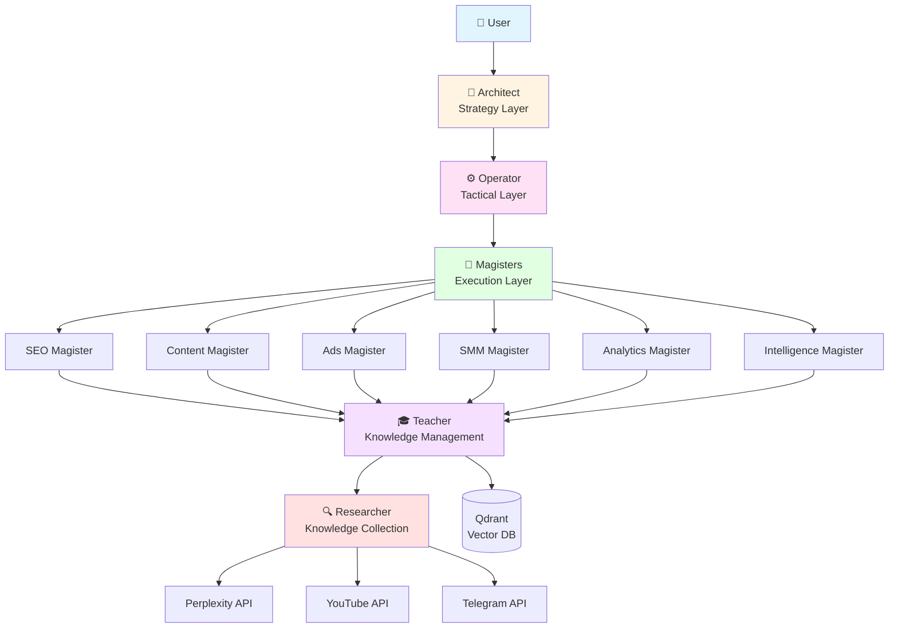
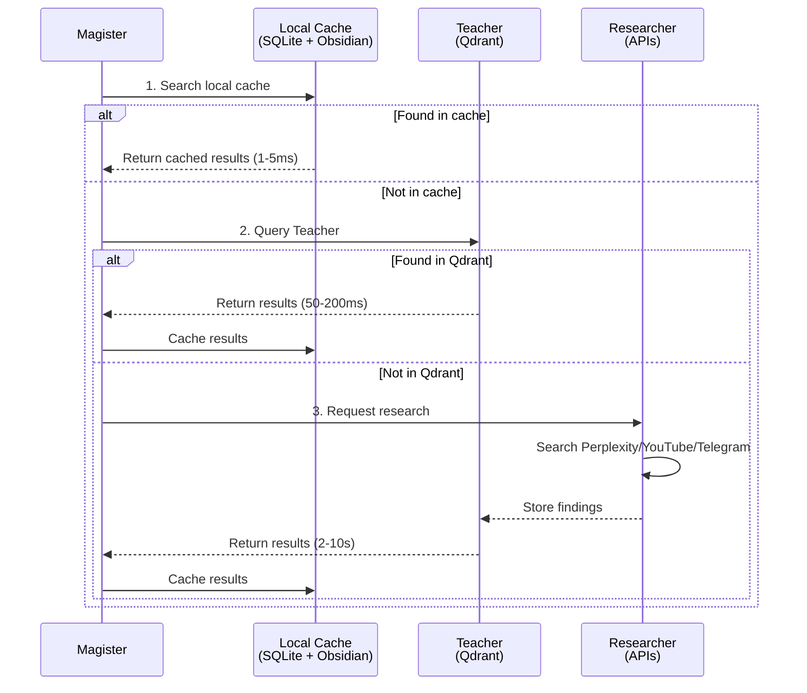
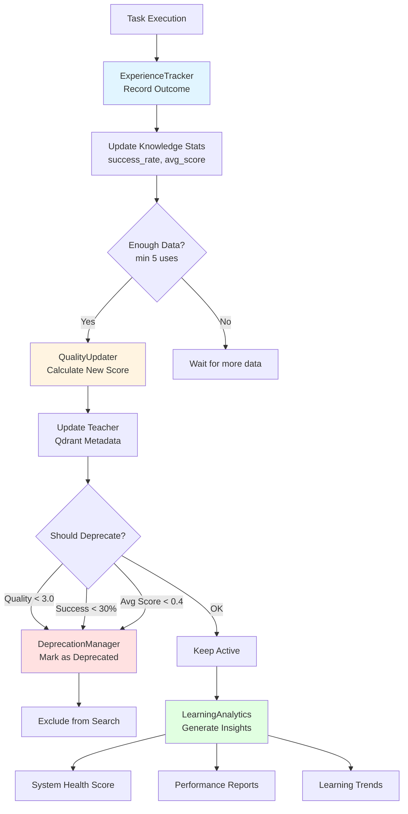
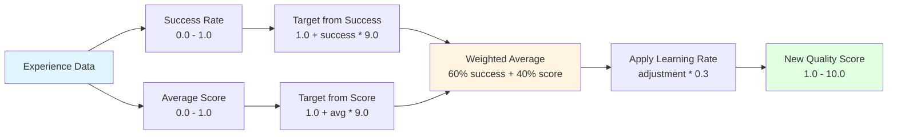
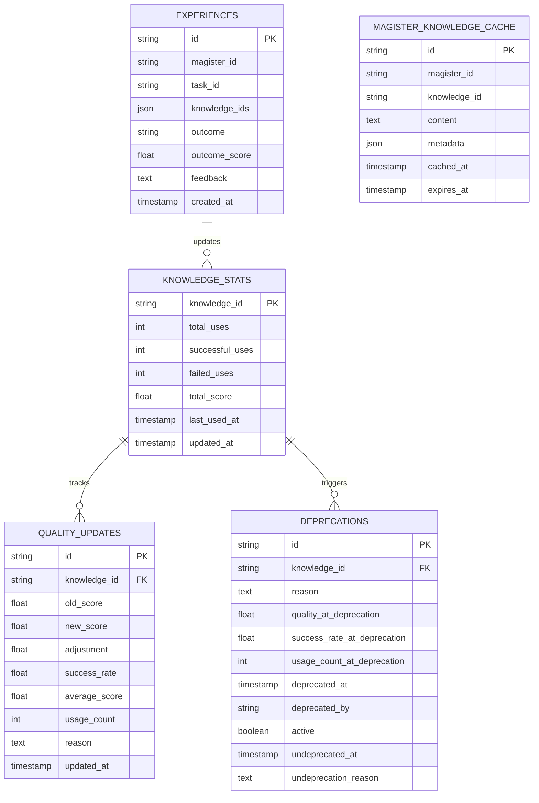
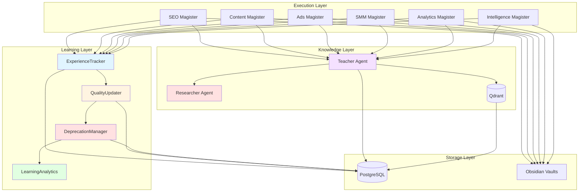
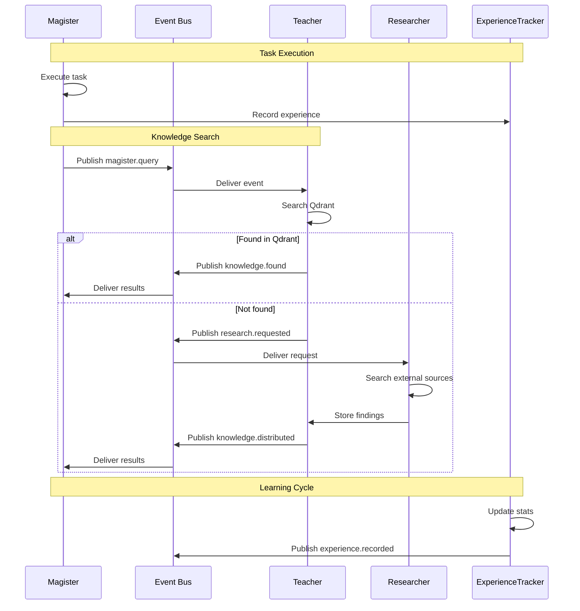
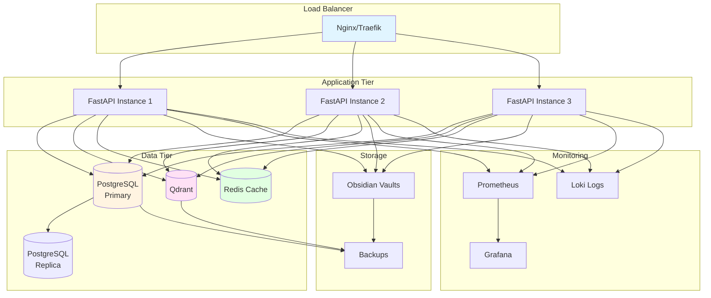
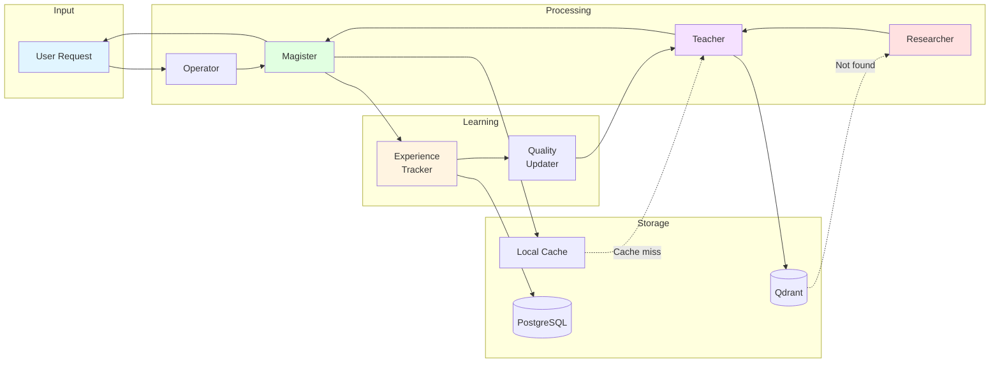
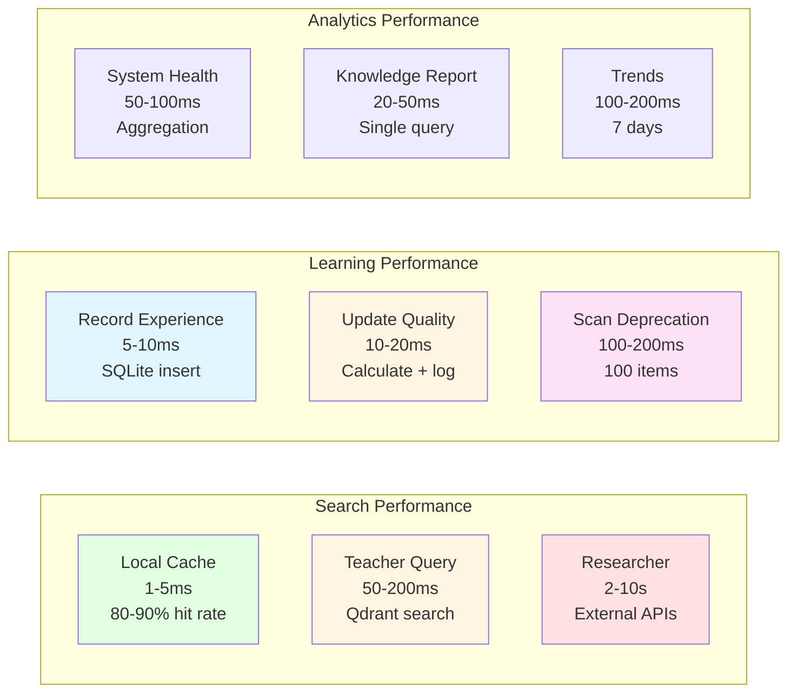

# Architecture Diagrams

## System Overview

## Hybrid Search Flow

## Experience Learning Flow

## Quality Score Calculation

## Database Schema

## Component Interaction

## Event Flow

## Deployment Architecture

## Data Flow

## Performance Metrics

## See Also

- [Getting Started](getting-started.md)
- [Magisters Guide](magisters.md)
- [Experience Learning](experience-learning.md)
- [Deployment Guide](deployment.md)
